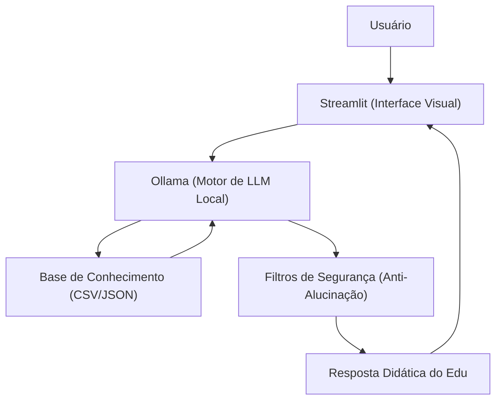

# 💸 Efi - Educador Financeiro Inteligente

O **Efi** (ou **Edu**) é um agente de Inteligência Artificial Generativa focado em educação e alfabetização financeira em linguagem acessível. A solução atua como um professor particular de finanças pessoais 24 horas por dia, ensinando conceitos, explicando dinâmicas de mercado e contextualizando o aprendizado prático a partir da análise segura de dados históricos do próprio usuário, sem jamais realizar recomendações de investimento.

---

## 🎯 Caso de Uso e Escopo

*   **Problema:** Grande parte dos brasileiros (como indicado por mais de 60% que desconhecem o funcionamento de reservas de emergência) carecem de letramento financeiro de forma intuitiva, sentindo barreiras ou intimidação técnico-formal.
*   **Solução:** Um agente financeiro consultivo e didático que decodifica termos de mercado (como CDI, Selic, FIIs), analisa hábitos de gastos baseados em transações reais do cliente e orienta a estruturação de metas, garantindo uma abordagem amigável e puramente educativa.
*   **Persona:** **Edu**, um educador financeiro empático, didático, paciente e informal. Ele atua sob premissas rígidas de segurança, admitindo limitações de conhecimento sempre que necessário.

---

## 🛠️ Arquitetura e Componentes da Solução

O projeto foi construído empregando uma abordagem baseada em IA Generativa de execução **100% local**, conferindo total privacidade e custo zero de infraestrutura de nuvem.



*   **Interface Front-End:** [Streamlit](https://streamlit.io/) estruturado para uma experiência fluida de chat interativo.
*   **Motor de Inferência:** [Ollama](https://ollama.ai/) rodando localmente o modelo `phi4-mini`.
*   **Orquestração e Contexto:** Injeção dinâmica estruturada via scripts em Python (`pandas` e `json`), gerando prompts contextualizados com zero-shot e few-shot learning integrados.

---

## 📂 Estrutura Atual do Repositório

```
📁 lab-agente-financeiro/
│
├── 📄 README.md                      # Apresentação geral do projeto Efi
│
├── 📁 data/                          # Base de Conhecimento
│   ├── historico_atendimento.csv     # Continuidade de interações passadas
│   ├── perfil_investidor.json        # Objetivos, metas e perfil do cliente
│   ├── produtos_financeiros.json     # Catálogo conceitual (ex: FIIs, CDB, Selic)
│   └── transacoes.csv                # Histórico de receitas e despesas
│
├── 📁 docs/                          # Documentação completa de desenvolvimento
│   ├── 01-documentacao-agente.md     # Detalhamento de personas e arquitetura
│   ├── 02-base-conhecimento.md       # Estratégia de modelagem de dados e contexto
│   ├── 03-prompts.md                 # Engenharia de prompts e tratamento de Edge Cases
│   ├── 04-metricas.md                # Resultados de testes e validação de qualidade
│   └── 05-pitch.md                   # Roteiro do Pitch comercial
│
├── 📁 src/                           # Código-fonte da aplicação funcional
│   └── app.py                        # Execução da interface Streamlit e conexão Ollama
│
└── 📁 assets/                        # Diagramas e recursos visuais
```

---

## 🛡️ Engenharia de Prompts & Estratégias de Segurança

O comportamento do **Edu** é blindado por um `SYSTEM_PROMPT` estruturado que define estritamente o seu domínio. 

### Diretrizes Anti-Alucinação Adotadas:
1.  **Bloqueio de Recomendação:** NUNCA prescreve ou recomenda a compra de ativos/produtos. Ele apenas explica e traduz a mecânica de funcionamento.
2.  **Restrição de Domínio:** Perguntas fora do escopo de finanças domésticas (ex: previsão do tempo, perguntas gerais) são educadamente recusadas.
3.  **Privacidade de Dados:** Nega terminantemente qualquer fornecimento ou manipulação de informações confidenciais ou sensíveis (como senhas).

---

## 📈 Avaliação e Resultados

A solução passou por baterias de testes focados em três pilares analíticos: **Assertividade**, **Segurança** e **Coerência**.

*   **Destaques Positivos:** Respostas rápidas e eficientes rodando em hardware local; alta aderência às diretrizes de tom de voz; recusa correta de edge cases perigosos ou fora de escopo.
*   **Oportunidades de Evolução:** Implementação futura de histórico persistente de conversas (memória de longo prazo) e otimização do tempo inicial de aquecimento do modelo no Ollama.

---

## 🚀 Como Executar o Projeto

1.  Certifique-se de possuir o **Ollama** instalado e o modelo `phi4-mini` baixado:
    ```bash
    ollama run phi4-mini
    ```
2.  Instale as dependências da aplicação Python:
    ```bash
    pip install streamlit pandas requests
    ```
3.  Inicie o servidor do Streamlit a partir da raiz do projeto:
    ```bash
    streamlit run src/app.py
    ```
